# ngit - Structured Git Workflows 🧹🚀

**Inspired by Kent Beck's "Tidy First?" philosophy**  
*"Before making a change, first make the code structure match the desired behavior, then make the obvious behavioral change."*

## Philosophical Foundation

Kent Beck's ["Tidy First?"](https://tidyfirst.substack.com/) introduces a crucial software development practice:
```text
1. Tidy (Structural Changes):  
   - Improve code structure without altering behavior  
   - Renames, interface extraction, dependency reorganization  

2. Behavior Changes:  
   - Add features, fix bugs, modify functionality  
   - Keep focused on user-visible outcomes
```

**ngit operationalizes this philosophy** by:

```mermaid
flowchart LR
    A[Uncommitted Changes] --> B{ngit tidy}
    B --> C[🧹 Structural Commit]
    B --> D[🚀 Behavioral Commit]
    C --> E[Clean History]
    D --> E
```


## How ngit Enables "Tidy First"

### 1. Intentional Code Evolution
```bash
# Before
git commit -m "Update stuff"

# With ngit
ngit tidy --ai
# Creates:
# - chore(core): normalize service interfaces [structural]
# - feat(auth): add session timeout [behavioral]
```

### 2. Safe Refactoring
```bash
# Automatic backup before any changes
🔒 Backup ID: 9804c08 (2024-03-15 14:30:00)

# Focused structural changes
ngit tidy -g atomic --language python
# Rename utils/ → core/
# Extract validation module
```

### 3. Clear Historical Context
```bash
➜ ngit ls -n 2
a1b2c3d 🧹 refactor(db): normalize transaction interface
d4e5f6c 🚀 feat(api): add pagination to user endpoint
```

## Key Features

| Feature                  | Beck's Concept                | ngit Implementation          |
|--------------------------|-------------------------------|-------------------------------|
| Change Classification    | Structural vs Behavioral      | AST analysis + ML heuristics  |
| Atomic Operations         | Safe, incremental changes     | Automatic Git backups         |
| Historical Transparency  | Documented evolution          | 🧹/🚀 commit markers          |
| Focus Maintenance        | Reduce cognitive load         | Interactive review mode       |

## Getting Started

```bash
# Install
pip install ngit

# Configure AI (optional)
export DEEPSEEK_API_KEY='your-key'

# See Beck's philosophy in action
ngit tidy --ai -i
```

## Workflow Comparison

**Traditional Git**  


**ngit Workflow**  


## Why This Matters

1. **Better Code Reviews**  
   Isolated structural changes let reviewers focus on logic rather than style

2. **Accurate Bisecting**  
   Pure behavioral commits reduce false positives when tracking regressions

3. **Sustainable Pace**  
   Incremental tidying prevents "big bang" refactors

4. **Documented Evolution**  
   Clear history shows *why* changes were made, not just *what* changed

"First tidy, then behave. ngit helps you do both with intention."  
*– Inspired by Kent Beck's "Tidy First?"*
